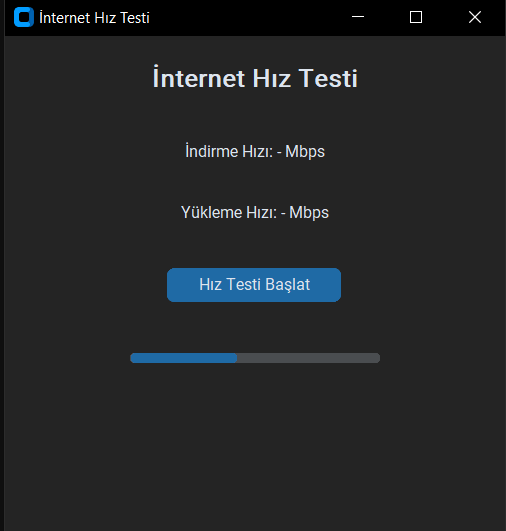
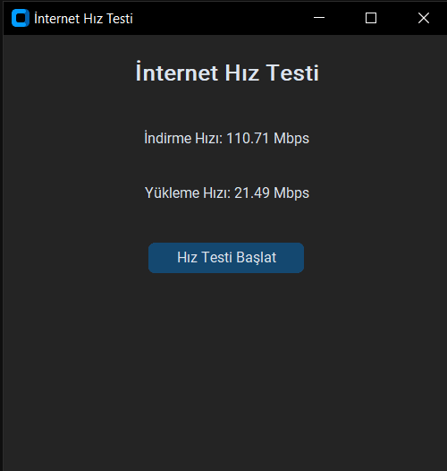

# İnternet Hız Testi Uygulaması

Bu Python masaüstü uygulaması, `speedtest-cli` kullanarak internet indirme ve yükleme hızlarını ölçer. Kullanıcı arayüzü, modern bir görünüm sağlayan `CustomTkinter` ile oluşturulmuştur.

## Özellikler
- **İndirme Hızını Ölçer**: Mevcut indirme hızını Mbps cinsinden gösterir.
- **Yükleme Hızını Ölçer**: Mevcut yükleme hızını Mbps cinsinden gösterir.
- **Yükleniyor Animasyonu**: Hız testi devam ederken bir yükleme simgesi gösterir.
- **Koyu Tema**: Koyu renkli bir tema ile modern bir arayüz sağlar.

## Ekran Görüntüleri

